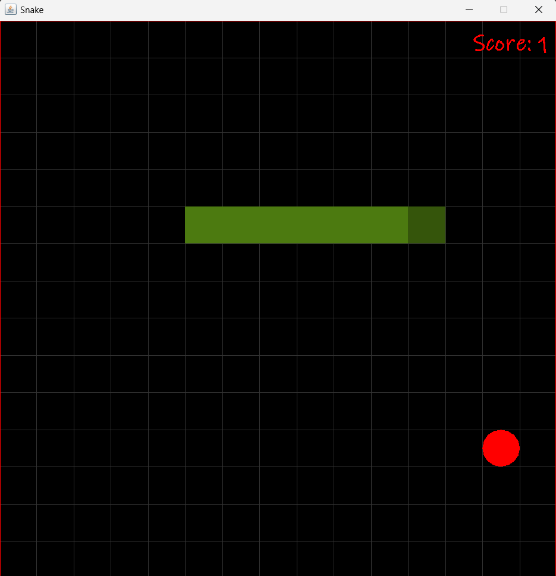

# SnakeGame

Welcome to the classic Snake Game!
---

How to Play

Controls:
    Use the arrow keys to change the snake's direction.
    Press R to restart the game.
    
Objective:
    Control the snake to eat apples without hitting the walls or itself.
    Eating apples increases the snake's length and speed.
---

Getting Started

To run the Snake Game:

 Using Java:
    Ensure you have Java installed on your system.
    Clone this repository to your local machine.
    Compile the Java files.
    Run the SnakeGame.java file.

 Using .jar File:
    Alternatively, download the SnakeGame.jar file from the Releases section.
    Run the game by executing the .jar file.

Screenshot:

